# Crypto Streaming Platform

A real time analytics platform for cryptocurrency trades. It reads live trades from
Binance and Coinbase, processes them with Apache Flink, stores results in ClickHouse
for fast queries, and shows them on Grafana dashboards. Raw trades are also archived
to an Iceberg data lake so a batch job can later check that the streaming numbers are
correct.

This is a portfolio project built to practice real data engineering: streaming,
stateful processing, a lakehouse, batch vs streaming reconciliation and monitoring.

## Articles

- [Architecture overview](https://medium.com/@dabahian.a1/494eb283fe27) — what the platform is and why each piece is there.
- [Four production bugs (deep-dive)](https://medium.com/@dabahian.a1/3670f41f2139) — the real problems I debugged and fixed.

## Dependency on external data contracts

This project depends on the message format of the Binance and Coinbase
WebSocket APIs. The producers parse specific fields (price, quantity,
timestamp, symbol) from a fixed message structure and the Avro schemas
in the Schema Registry describe that structure.

If either exchange changes its data contract — renames a field, changes a
type, or restructures the message — the producers will fail to parse new
messages and the pipeline will stop receiving valid data. This is an
inherent risk of consuming third-party APIs: the upstream format is owned
by the exchange not by this project.

In production this would be handled by:

- **Schema validation at ingestion** — reject and route malformed messages
  to the dead letter queue (`dlq-events`) instead of failing the producer,
  so one bad message does not stop the stream.
- **Schema Registry compatibility checks** - use Avro schema evolution rules
  (backward/forward compatibility) so consumers keep working when the schema
  changes in a compatible way.
- **Monitoring on parse errors** — alert when the rate of failed parses or
  DLQ messages rises, so a contract change is detected quickly.

For this portfolio project the producers assume the current (June 2026)
message formats and do not yet implement full schemaevolution handling.

## What it does

- **Ingest**: two Python producers connect to Binance and Coinbase over WebSocket and
  send trades to Kafka. Messages are serialized with Avro through a Schema Registry.
- **Stream processing (Flink)**: five jobs run continuously:
  - **VWAP** – volume-weighted average price per symbol, in time windows.
  - **Whale Detector** – flags very large single trades.
  - **Arbitrage Monitor** – finds price gaps for the same asset between the two exchanges.
  - **Double Bottom CEP** – detects “double bottom” chart pattern. This is a W-shaped price movement that traders read as a possible trend reversal, the price drops to a low, bounces up, drops again to about the same low and then breaks above the bounce. Spotting it is not a single condition, it is a sequence of events in the right order over time (drop → bottom → rise → peak → drop → bottom → breakout). I detect it with Flink SQL’s MATCH_RECOGNIZE which works like a regular expression over the stream of prices. This is Complex Event Processing, finding patterns across a sequence of events not filtering single ones. In practice this pattern is unreliable on raw tick data. I included it to demonstrate CEP, not as a real trading strategy.
  - **Iceberg Sink** – writes raw trades to the data lake (MinIO + Iceberg + Nessie).
- **Storage**:
  - **ClickHouse** holds the streaming results (fast OLAP queries for dashboards).
  - **MinIO + Iceberg** is the data lake for raw trades and checkpoints.
- **Reconciliation (batch)**: an Airflow job runs every hour. It re computes VWAP from
  the raw data in Iceberg and compares it with the streaming VWAP in ClickHouse. This
  is a data quality check: if the two numbers drift apart, something is wrong.
- **Monitoring**: Prometheus scrapes metrics from a Kafka exporter and from ClickHouse.
  Grafana shows both the business dashboards and the system health.

## Architecture

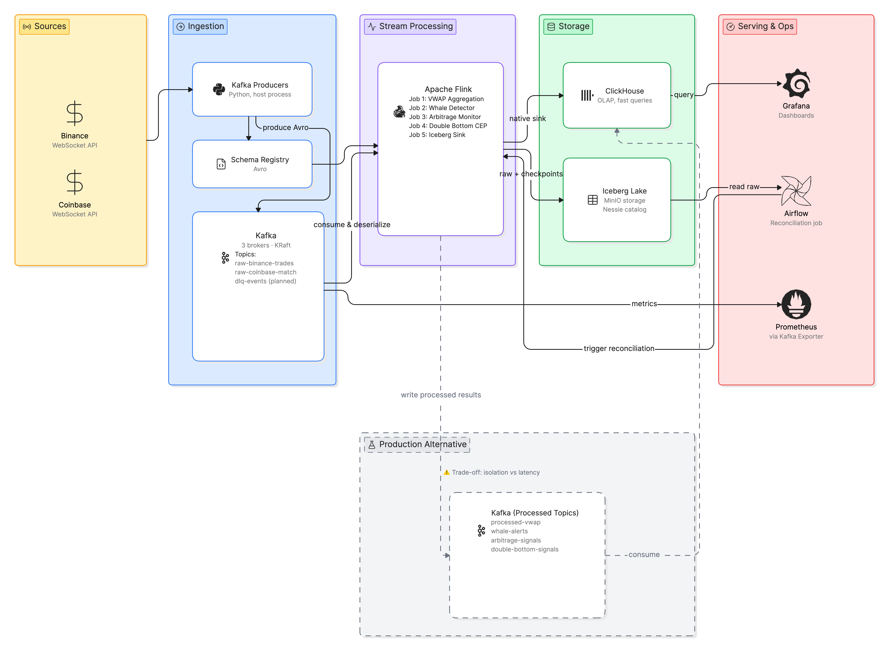

<details>
<summary>Text version of the diagram</summary>

```
Binance / Coinbase  ──>  Python Producers  ──>  Kafka  ──>  Flink (5 jobs)
   (WebSocket)            (host, Avro)         (3 brokers)        │
                                                                  ├──> ClickHouse ──> Grafana
                                                                  └──> MinIO + Iceberg (Nessie catalog)
                                                                              │
                                              Airflow (hourly) ──> Reconciliation: Iceberg vs ClickHouse

Monitoring:  Kafka Exporter + ClickHouse  ──(scrape)──>  Prometheus  ──>  Grafana
```

</details>

## Screenshots

### Grafana — analytics dashboard
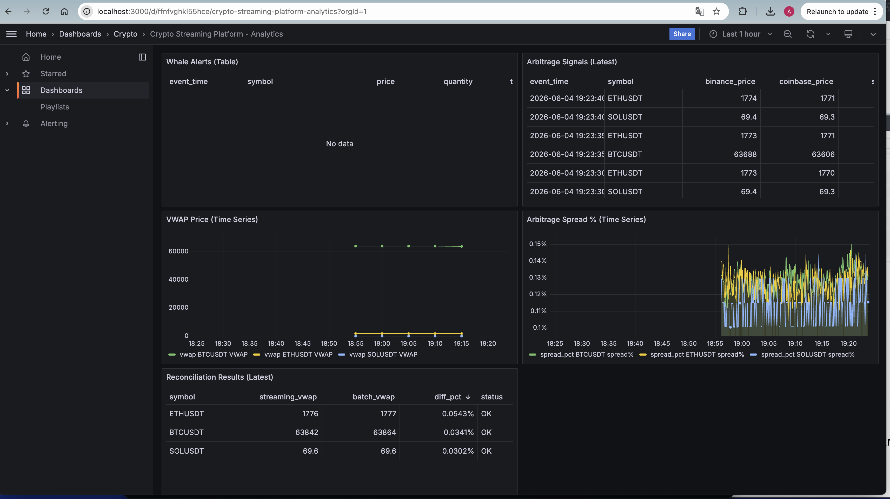

Whale Alerts

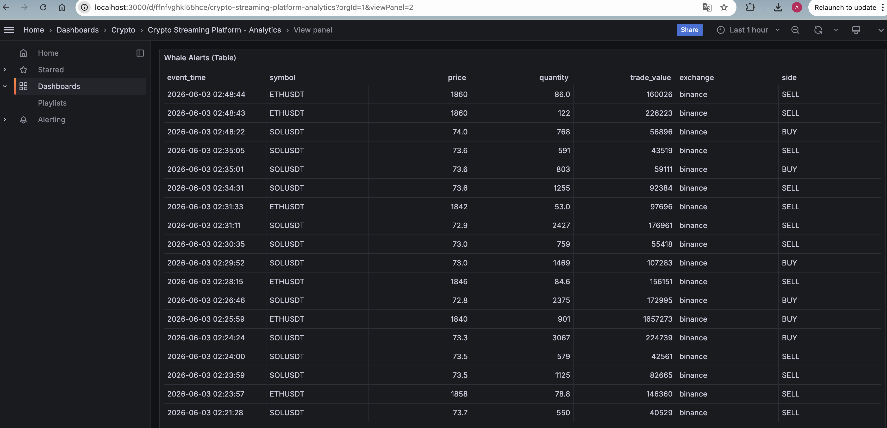

Reconciliation Results

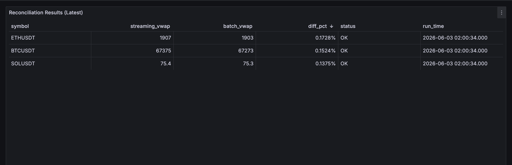

Arbitrage Signals

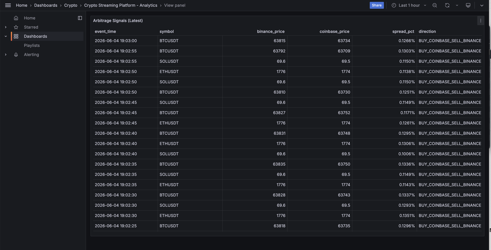

### Flink — running jobs
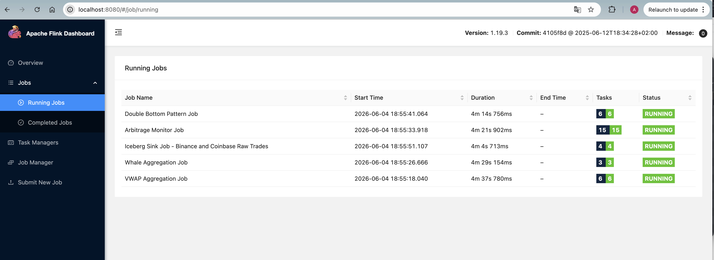

### Kafka UI — topics and messages
Raw Binance Trades
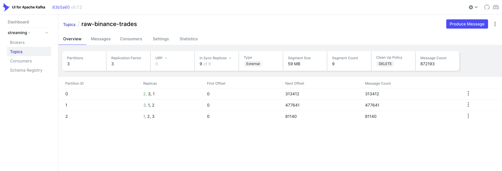

Raw Coinbase Trades

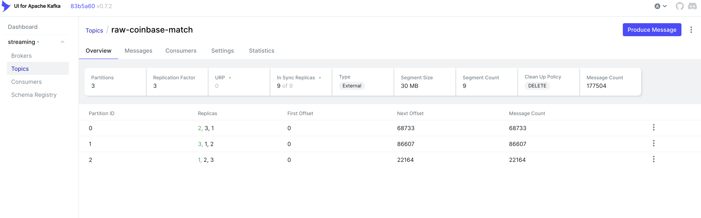

Example of message

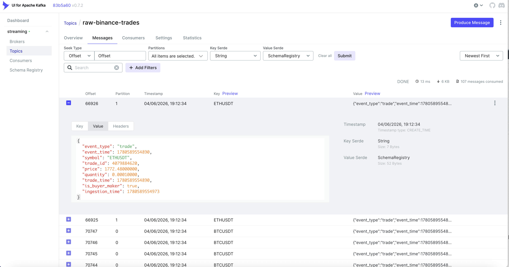

### Prometheus — targets
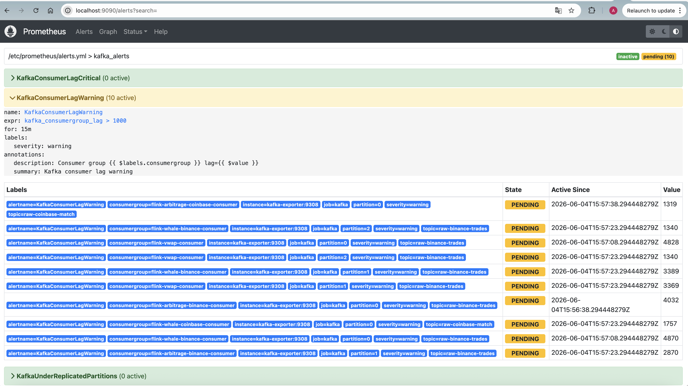

## Tech stack

Kafka (KRaft, 3 brokers) · Schema Registry (Avro) · Apache Flink (PyFlink) ·
ClickHouse · MinIO · Apache Iceberg · Nessie · Apache Airflow · Prometheus ·
Grafana · Docker Compose.

### Iceberg table maintenance (not implemented)

Iceberg tables need periodic maintenance over time:
- compaction — merge many small files into fewer
  large ones for faster reads.
- snapshot cleanup — drop old snapshots from the
  table history.
- orphan file removal  — delete files left in
  storage that no snapshot references, e.g. after a failed write between
  a Flink checkpoint and the snapshot commit.

In this project the maintenance task is a placeholder. PyIceberg could
not run these procedures against the tables written by Flink's Nessie
catalog, due to a metadata format mismatch between the two.

The production solution is a scheduled Spark job (e.g. on AWS Glue or
Databricks) running `rewrite_data_files`, `expire_snapshots`, and
`remove_orphan_files`. This is left as a known gap rather than
implemented since it would require adding Spark to a single machine
setup.

## Requirements

- **Docker Desktop** with at least **16 GB of memory** assigned
  (Settings -> Resources -> Memory). The stack is heavy: two Flink TaskManagers
  alone can use several GB. With less memory the brokers become unstable.
- **Python 3.10+** on the host (the producers and helper scripts run outside Docker).
- About **2 GB of free disk** for the Docker images. The first start downloads them,
  which can take a while.

## Tested environment

I developed and tested this project on a MacBook Pro (M1 Pro, 32 GB RAM).

I have not tested it on Windows, so I can't give reliable advice there, 
you may run into issues, especially with the `Makefile` and the host-side
commands which assume a Unix-like shell.

## Quick start

```bash
# 1. clone and enter the project
git clone https://github.com/data-engineering-efforts/crypto-streaming-platform.git
cd crypto-streaming-platform

# 2. create a Python environment for the host scripts
python -m venv venv
source venv/bin/activate
pip install -r requirements.txt

# 3. copy the example environment file (defaults work for local use)
cp .env.example .env

# 4. start everything: infra -> wait until healthy -> create topics -> submit Flink jobs
make up

# 5. in a SECOND terminal, start the producers (they run in the foreground)
source venv/bin/activate
make producers
```

The first `make up` is slow because Docker builds the Flink and Airflow images and
pulls all the other images. Later starts are much faster.

> **Note:** the producers are started separately on purpose. They are long-running
> processes that keep streaming trades, so they would block `make up` from finishing.

## Web interfaces

| Service        | URL                     | Notes                                  |
|----------------|-------------------------|----------------------------------------|
| Grafana        | http://localhost:3000   | dashboards (default login admin/admin) |
| Flink UI       | http://localhost:8080   | jobs, checkpoints, backpressure        |
| Kafka UI       | http://localhost:8090   | topics, messages, consumer groups      |
| Airflow        | http://localhost:8082   | reconciliation DAG                     |
| Prometheus     | http://localhost:9090   | metrics and alerts                     |
| MinIO Console  | http://localhost:9001   | data lake buckets                      |
| Nessie         | http://localhost:19120  | Iceberg catalog                        |
| ClickHouse     | http://localhost:8123   | SQL Play UI                            |

## Useful commands

```bash
make help # list all commands
make ps # show containers and their restart policy
make logs # tail logs of all services
make test # run the unit tests (separate from running the platform)
make down # stop services, keep the data
make clean # stop services AND delete volumes (wipes all data)
```

## Kafka topics

| Topic                | Partitions | Purpose                          |
|----------------------|-----------|-----------------------------------|
| `raw-binance-trades` | 3         | raw Binance trades                |
| `raw-coinbase-match` | 3         | raw Coinbase matches              |
| `dlq-events`         | 1         | dead-letter queue (planned)       |

Auto-creation of topics is turned off on purpose, so `make up` creates them with the
right partition count and config.

## ClickHouse tables

All result tables use `ReplacingMergeTree(version)` for deduplication:
`vwap_aggregations`, `whale_alerts`, `arbitrage_signals`, `double_bottom_signals`,
`recon_results`.

Because deduplication happens in the background (not at insert time), dashboard
queries use `FINAL` to always read the deduplicated result.

## Testing

```bash
make test
```

The tests cover the producer parsing logic, the Flink record transforms and the Avro
schema round trip. Tests that need PyFlink or `confluent_kafka` are skipped if those
libraries are not installed, so the Avro tests run in any environment.

## Known limitations

These are intentional trade offs for a local portfolio project, written down honestly:

- **Producers run on the host, not in Docker.** This keeps local development simple.
  In production they would be containerized services.
- **ClickHouse sink is a Flink `MapFunction` with micro-batching.** PyFlink does not
  expose `RichSinkFunction`, so the sink buffers in a plain Python list not in Flink
  state. This gives **at-least-once** delivery, duplicates are removed by
  `ReplacingMergeTree`. A fully correct version would use
  `KeyedProcessFunction` + `ListState` + processing-time timers.
- **Whale thresholds are high** (5 BTC, 50 ETH, 500 SOL per single trade). Real whale
  trades are rare, so the Whale Alerts panel can stay empty for a long time. Lower the
  thresholds in `whale_job.py` if you want to see more alerts during a demo.
- **Memory matters.** With less than 16 GB for Docker, ClickHouse and Flink can
  starve the VM and the Kafka brokers may drop heartbeats and re elect leaders.
- **Some images use `latest` tags.** Pinning exact versions would improve
  reproducibility.

## Engineering notes / What I learned

Real bugs I hit while building this and how I fixed them. Each one is a short story
about a non-obvious failure mode.

- **Naive vs aware datetime broke deduplication.** `datetime.strptime()` returns a
  *naive* datetime. Calling `.timestamp()` on it silently uses the machine's local
  timezone, so the `version` value for `ReplacingMergeTree` was different on a UTC
  server and on my local Mac. Deduplication quietly stopped working. Fix: make the
  datetime UTC aware with `.replace(tzinfo=timezone.utc)` before `.timestamp()`. Keep
  all time UTC aware inside the system.

- **Flink Direct Memory OOM in the Iceberg sink.** The job crashed with
  `OutOfMemoryError: Direct buffer memory`. The cause was that
  `taskmanager.memory.task.off-heap.size` defaults to 0, while the Parquet writers
  use direct (off-heap) buffers. Two parallel writers shared a tiny direct memory
  pool. Fix: set `task.off-heap.size: 256m`.

- **A producer stopped sending but did not crash.** After some hours the producer was
  still running but no new trades arrived. The WebSocket had `ping_interval=None`, so
  the client never detected a dead (half open) connection and `async for` waited
  forever. The reconnect logic never triggered because no exception was raised. Fix:
  set `ping_interval` and `ping_timeout` so the library detects the dead connection
  and the existing reconnect runs.

- **Grafana showed duplicates from `ReplacingMergeTree`.** Deduplication happens during
  background merges, not at insert time, so a plain `SELECT` could return rows that
  were not merged yet. Fix: add `FINAL` to the dashboard queries.

- **Idle Kafka partition stalled the windows.** With only three symbols, one partition
  could receive no data. Its watermark stayed at `-infinity`, so event-time windows
  never closed. Fix: enable idle partition detection and itentionally distribute three symbols(BTC, ETH, SOL)
  among the three partition(not production solution)
  (`scan.idle-partition-detection.interval`).
  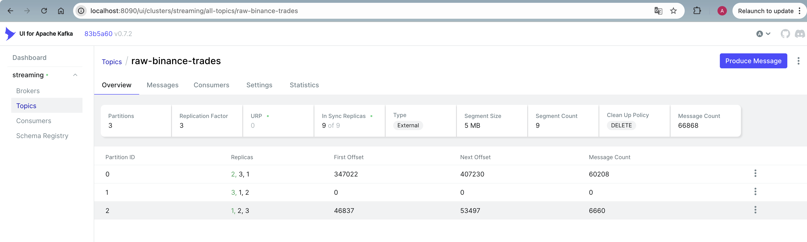

- **Most consumer-lag alerts were false alarms.** A short backlog after a restart is
  normal and the job catches up fast. Fix: set `for: 15m` on the lag alerts so only
  sustained lag fires, and disable the `consumergroup_members == 0` alert because Flink
  manages its own offsets and does not register as an active group member.

## Project layout

```
producers/        # Binance + Coinbase WebSocket producers (Avro)
flink_jobs/        # 5 streaming jobs + reconciliation batch job + shared sink code
scripts/           # create_topics.py
clickhouse/        # config + init SQL (table definitions)
monitoring/        # Prometheus config, alerts, Grafana dashboards
airflow/           # reconciliation DAG + Flink operator
docker/            # custom Flink image (with Iceberg/Nessie JARs)
tests/             # pytest suite
docker-compose.yml
Makefile
```
