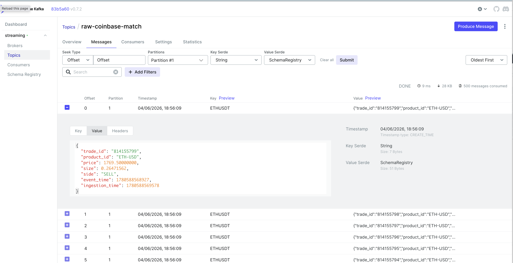

# Building a Real-Time Crypto Analytics Platform with Kafka, Flink, ClickHouse and Iceberg

*A walkthrough of a streaming data platform I built to learn real data engineering and the architecture decisions behind it.*

---

## Why I built this

I wanted a project that uses the tools real data engineers use every day, not a toy example. So I built a platform that reads live cryptocurrency trades from two exchanges, processes them in real time, stores the results for fast queries, and shows everything on dashboards. It also keeps a copy of the raw data in a data lake, so a batch job can later check that the streaming numbers are correct.

The whole thing runs on a single machine with Docker Compose. It ingests around **180 events per second** on average (about **15 million events per day**) from two exchanges, and it touches most of the parts you would find in a production streaming system: a message broker, a stream processor, an OLAP database, a lakehouse, an orchestrator, and full monitoring.

This is the first article in a short series. Here I explain **what the platform does and why each piece is there**. The second article is a technical deep dive into the bugs and trade-offs I hit while building it.

---

## The big picture

The data flows like this:

1. **Two Python producers** connect to the Binance and Coinbase WebSocket APIs and read live trades.
2. They send the trades to **Kafka**, serialized with Avro through a **Schema Registry**.
3. **Apache Flink** reads from Kafka and runs five jobs in parallel.
4. Results go to **ClickHouse** for fast dashboard queries.
5. Raw trades also go to a **data lake** (MinIO + Iceberg + Nessie) for batch checks.
6. **Airflow** runs an hourly reconciliation job that compares the streaming numbers with the batch numbers.
7. **Prometheus and Grafana** watch the health of the whole system.

Let me go through each part and explain why it is there.

---

## Ingestion: producers, Kafka, and Avro

The two producers run on the host as normal Python processes. Each one opens a WebSocket to an exchange and streams trades into a Kafka topic: `raw-binance-trades` and `raw-coinbase-match`. Each topic has 3 partitions.

I use **Avro with a Schema Registry** instead of plain JSON. The reason is that a schema gives the data a contract: the producer registers the schema once, and Flink retrieves it to decode the messages. This makes the format explicit and catches mistakes early, which matters more as a system grows.

### Topic configuration: choosing reliability settings

I picked topics based on what each
topic needs:

- **Replication factor 3, min.insync.replicas 2.** Each message is written
  to 3 brokers, and a write is only confirmed when at least 2 of them have
  it. This means the platform survives losing one broker without losing data
  or stopping writes. It is the standard durable setup for Kafka.
- **3 partitions** for the trade topics - one logical partition per symbol
  (BTC, ETH, SOL), so the work can be spread across consumers.
- **lz4 compression** for the trade topics, because they are latency sensitive
  and lz4 is fast, **zstd** for the low-volume dead-letter topic, where saving
  disk matters more than speed.
- **Retention tuned per topic** - 24h for Binance (enough to land in the lake),
  6h for Coinbase (enough for the arbitrage job to replay), 7 days for the
  dead-letter topic (time to investigate problems).

### The exchange data contracts

The producers consume two public WebSocket APIs:

- **Binance** - the `@trade` stream, which sends one message per individual trade (price, quantity, timestamp, symbol). [Binance WebSocket docs](https://developers.binance.com/docs/binance-spot-api-docs/web-socket-streams)
- **Coinbase** - the Advanced Trade WebSocket (`market_trades` channel), which sends a message every time a trade happens. [Coinbase Advanced Trade WebSocket docs](https://docs.cdp.coinbase.com/advanced-trade/docs/ws-overview)

Here is what a raw Binance trade message looks like:

Coinbase raw message:

Each producer parses the fields it needs from these messages, builds an Avro record, and sends it to Kafka. The Avro schema is the formal version of this contract: it says exactly which fields exist and what types they have.

This dependency is also a risk. If an exchange changes its message format: renames a field or changes a type, the producers would stop parsing new messages correctly. I describe how a production system would handle this (schema evolution, a dead-letter queue, parse error alerts) in the limitations section.

**Why Kafka?** Kafka decouples the producers from the processing. The producers just write trades as fast as they arrive. Flink reads them at its own pace. If Flink is busy or restarts, the data waits safely in Kafka and nothing is lost.

---

## Stream processing: Apache Flink

Flink is the heart of the platform. It reads the raw trades from Kafka and runs **five jobs** at the same time:

- **VWAP Aggregation** - the volume weighted average price per symbol, in time windows.
- **Whale Detector** - flags very large single trades (for example, a single trade of 5+ BTC).
- **Arbitrage Monitor** - finds price differences for the same asset between Binance and Coinbase.
- **Double Bottom CEP** - detects  "double bottom" chart pattern.
  This is a W-shaped price movement that traders read as a possible trend
  reversal: the price drops to a low, bounces up, drops again to about the
  same low, and then breaks above the bounce. Spotting it is not a single
  condition - it is a sequence of events in the right order over time
  (drop → bottom → rise → peak → drop → bottom → breakout). I detect it with
  Flink SQL's `MATCH_RECOGNIZE`, which works like a regular expression over
  the stream of prices. This is Complex Event Processing: finding
  patterns across a sequence of events, not filtering single ones. `MATCH_RECOGNIZE`.
  (In practice this pattern is unreliable on raw tick data. I included it
  to demonstrate CEP, not as a real trading strategy.)
- **Iceberg Sink** - writes the raw trades to the data lake.

**Why Flink?** Because these jobs need real streaming features: event-time windows, watermarks, stateful joins, and complex event processing. Flink does all of this natively. The arbitrage job, for example, joins two live streams, the double-bottom job matches a sequence of price moves over time. You cannot do this cleanly with simple consumers.

---

## Storage: ClickHouse and the data lake

There are two storage layers, and they answer two different questions.

**ClickHouse** stores the streaming results. It is an OLAP database built for fast queries over large amounts of data. When Grafana draws a chart of VWAP prices or lists the latest arbitrage signals, it queries ClickHouse, and the answer comes back in milliseconds. ClickHouse is the right tool when you need fast reads for dashboards.

**MinIO + Iceberg** is the data lake. It stores the raw trades and the Flink checkpoints. MinIO is S3 compatible object storage; Iceberg is a table format on top of it; **Nessie** is the catalog that tracks the Iceberg tables (it tells Flink where a table is and which snapshot to read). This layer is for cheap, long-term storage of raw data - the source of truth that the batch job can re-read later.

So: ClickHouse for fast analytics, the lake for raw history.

---

## Data quality: reconciliation with Airflow

It is what real data teams worry about: **is the streaming pipeline actually correct?**

Every hour, **Airflow** triggers a batch reconciliation job. The job re-computes VWAP from the raw trades in the Iceberg lake, and compares it with the streaming VWAP that Flink wrote to ClickHouse. If the two numbers drift apart, something is wrong with the streaming path.

The result is a table with the streaming value, the batch value, the difference, and a status (OK / WARN / FAIL). This is a real **data-quality check** - it answers "can I trust the fast numbers?" by comparing them against a slower, independent calculation.

---

## Monitoring: Prometheus and Grafana

A streaming system that you cannot see into is dangerous. So the platform exposes metrics.

**Prometheus** scrapes metrics from a Kafka exporter (consumer lag, under-replicated partitions). **Grafana** shows both the business dashboards (prices, signals, reconciliation) and the system health.

One important idea: Prometheus uses a **pull** model. It does not connect to Kafka topics. Instead, a small Kafka exporter reads the broker metadata and exposes it on an HTTP endpoint, and Prometheus fetches that endpoint every few seconds. The topic name is just a label on the metric.

---

## The full stack

Kafka (KRaft, 3 brokers) · Schema Registry (Avro) · Apache Flink 1.19 (PyFlink) · ClickHouse · MinIO · Apache Iceberg · Nessie · Apache Airflow · Prometheus · Grafana · Docker Compose.

Everything starts with one command (`make up`), then the producers in a second terminal. The first start is slow because Docker builds the Flink image and pulls everything, but after that it comes up in seconds.

---

## Honest limitations

This is a portfolio project on one machine, so some choices are deliberate trade-offs, not production designs:

- The **producers run on the host**, not in Docker, to keep development simple.
- The **ClickHouse sink** is a custom batching `MapFunction`, which gives at-least-once delivery with deduplication, instead of a fully stateful sink.
- All five Flink jobs share **one session cluster**, so they share resources. In production I would isolate them.
- The platform **depends on the exchange data contracts**. If Binance or Coinbase changes its message format, the producers would need updating.

I wrote these down on purpose. Knowing where the limits are is part of understanding the system.

---

## What's next

This was the overview. In the **second article** I go deep into the real problems I hit and fixed: a timezone bug that silently broke deduplication, a Flink Direct Memory crash, a health check that lied about a healthy server, a producer that stopped without crashing, and an interval join that exploded under load and how I cut its CPU usage from 100% to 1%.

**The code is on GitHub:** [github.com/data-engineering-efforts/crypto-streaming-platform](https://github.com/data-engineering-efforts/crypto-streaming-platform)

**Read the technical deep-dive:** *(link to article 2)*

If you found this useful, I'd be glad to hear your thoughts.
